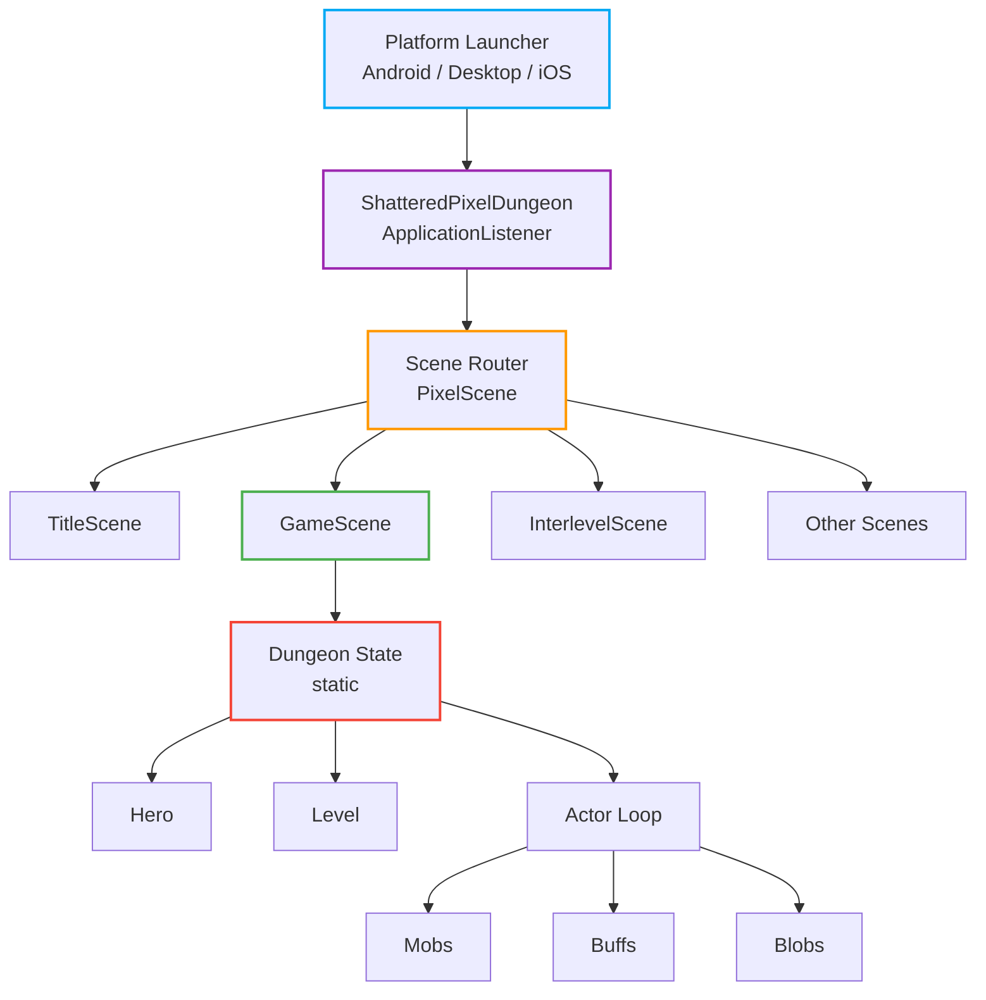
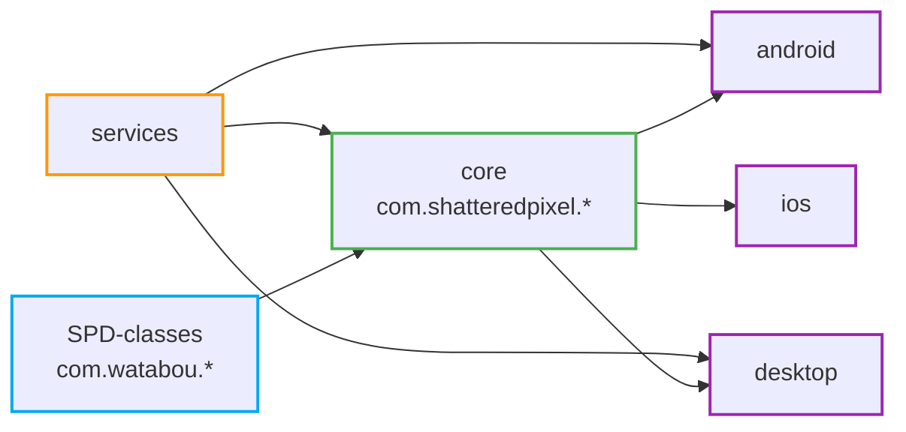
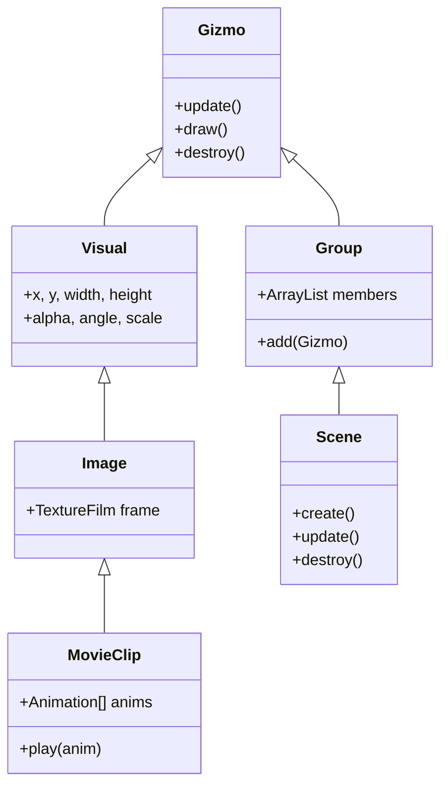
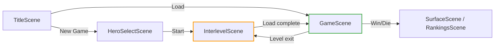

# Architecture — Shattered Pixel Dungeon

## System Overview

## Module Dependency Graph

## Layer Breakdown

### Platform Layer — `android/`, `desktop/`, `ios/`

Contains only OS-specific entry points. Zero game logic.

| Module | Launcher Class | Backend |
|--------|---------------|---------|
| android | `AndroidLauncher` | libGDX Android backend |
| desktop | `DesktopLauncher` | LWJGL3 |
| ios | `IOSLauncher` | RoboVM |

### Engine Layer — `SPD-classes/`

Custom libGDX wrapper, the Noosa scene graph. No game-domain knowledge.

### Game Entry — `ShatteredPixelDungeon`, `Dungeon`

- `ShatteredPixelDungeon` — boot, settings, scene switching
- `Dungeon` — static singleton for the active run (hero, level, depth, seed, quests)
- `Statistics` — cumulative run stats
- `Badges` — achievement tracking
- `Rankings` — high score persistence

### Scene Layer — `core/.../scenes/`

Each scene extends `PixelScene` and is self-contained.

### Actor System — `core/.../actors/`

Turn-based. All entities extend `Actor`. The loop picks the actor with the lowest `time` value and calls `act()`. See [game-loop.md](game-loop.md) for detail.

### Item System — `core/.../items/`

`Item` base class with deep inheritance. See [item-system.md](item-system.md) for the full hierarchy.

### Level System — `core/.../levels/`

Procedural. See [level-generation.md](level-generation.md) for the pipeline.

## Cross-Cutting Concerns

### Serialization

All persistable objects implement `Bundlable` (`storeInBundle` / `restoreFromBundle`). The `Bundle` class handles encoding to a binary/text format. Save files are stored per-platform in the app's data directory.

### Localization

`Messages.get(Class, "key")` loads from `.properties` files under `core/src/main/assets/messages/`. Keys are fully qualified: `com.shatteredpixel.shatteredpixeldungeon.items.potions.PotionOfHealing.name=Potion of Healing`.

### Event Bus

`Signal<T>` (in SPD-classes) provides a lightweight observer pattern used for decoupled communication (e.g., level events, hero death).

### Pathfinding

`PathFinder` (SPD-classes) uses Dijkstra on the flat tile grid (`Level.map` — a 1D int array of width×height).

## Key Static State

| Class | Role |
|-------|------|
| `Dungeon` | Active run: hero, level, depth, seed, quests, actors |
| `Statistics` | Turn count, gold collected, food eaten, etc. |
| `Badges` | Unlocked achievements |
| `SPDSettings` | Persisted player preferences |
| `Assets` | String constants for all asset file paths |
