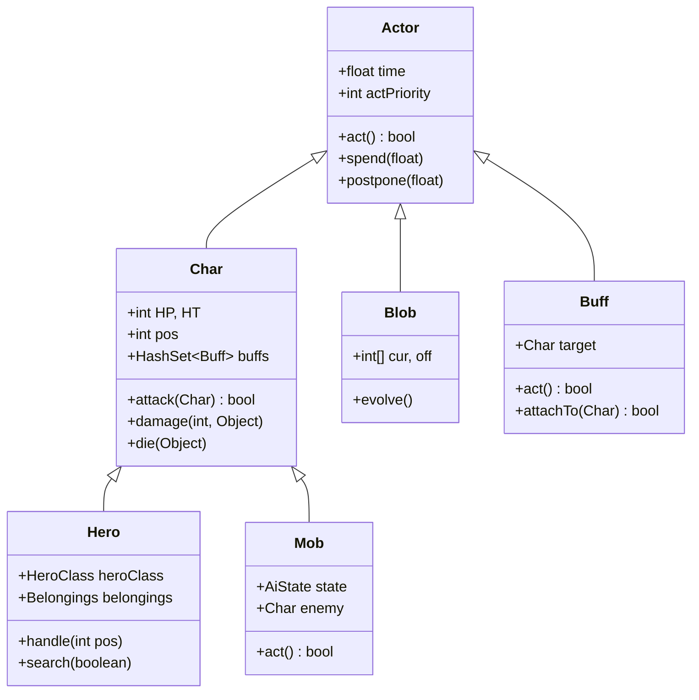
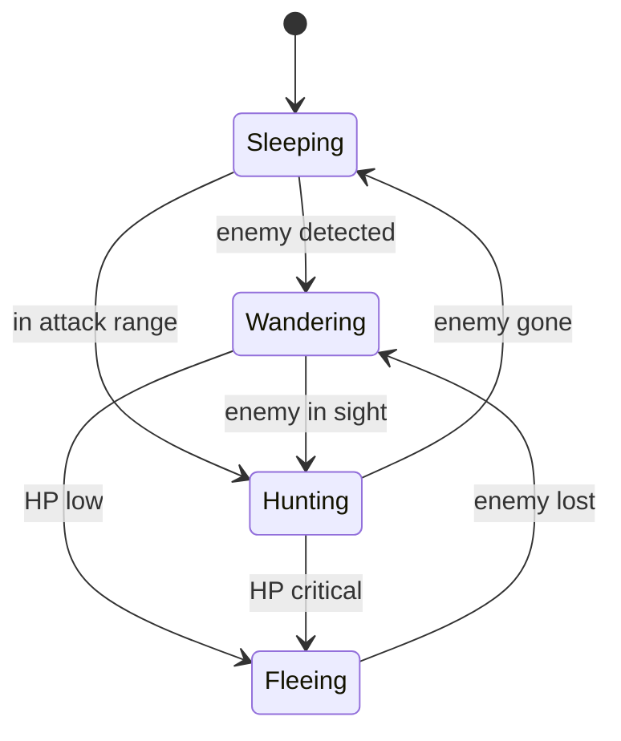

# Game Loop & Actor System — Shattered Pixel Dungeon

## Turn-Based Loop

The game uses a **time-based priority queue** rather than strict round-by-round turns. Each actor has a floating-point `time` value; the actor with the lowest time acts next. After acting, it calls `spend(n)` to advance its own time by `n` ticks.

```mermaid
flowchart TD
    A[Actor Loop starts] --> B{Any actor\nwith time ≤ now?}
    B -->|Yes| C[Pick lowest-time actor]
    C --> D[Call actor.act()]
    D --> E{Actor calls\nspend / postpone?}
    E -->|spend| F[actor.time += n\nAdvance game clock if needed]
    E -->|postpone| G[actor.time set to\nmax of current or now+n]
    F --> B
    G --> B
    B -->|No| H[Advance now\nto next actor time]
    H --> B

    style D stroke:#4CAF50,stroke-width:2px
    style C stroke:#03A9F4,stroke-width:2px
```

### Act Priority

When multiple actors share the same time, `actPriority` breaks ties (higher = acts first):

| Actor Type | Priority | Constant |
|-----------|---------|----------|
| Visual effects | 100 | `VFX_PRIO` |
| Hero | 0 | `HERO_PRIO` |
| Blobs | -10 | `BLOB_PRIO` |
| Mobs | -20 | `MOB_PRIO` |
| Buffs | -30 | `BUFF_PRIO` |

## Actor Class Hierarchy



## Hero

`Hero.act()` pauses the loop and waits for player input (`handle(int pos)` called on touch/key). The hero's action (move, attack, use item) determines how many ticks `spend()` is called with.

Key fields:
- `heroClass` — `HeroClass` enum (WARRIOR, MAGE, ROGUE, HUNTRESS, DUELIST, CLERIC)
- `subClass` — `HeroSubClass` enum (chosen mid-run)
- `belongings` — inventory + equipped items
- `exp`, `lvl` — experience and level

## Mobs

`Mob.act()` runs the AI state machine each turn.



The current state is stored in `Mob.state` (an `AiState` instance). Each mob can override default AI by implementing custom `AiState` objects or overriding `act()`.

## Buffs

`Buff.act()` is called each game tick the buff is active. Buffs attach to a `Char` and process effects (damage-over-time, duration countdown, stat modifications).

Buff lifecycle:
1. `Buff.affect(char, BuffClass.class)` — creates or finds existing buff on `char`
2. `attachTo(char)` called → buff added to `char.buffs`
3. `act()` called each tick → do effect, call `spend(TICK)`, or call `detach()` to remove

Common buff base types:
- `Buff` — generic, implement `act()` freely
- `FlavourBuff` — purely cosmetic / informational, no `act()` logic needed
- `CounterBuff` — tracks a count value
- `ChampionEnemy` — marks elite mobs

## Blobs

`Blob.act()` spreads or contracts area effects on the tile grid each turn. Stored in `Level.blobs` (a `HashMap<Class, Blob>`).

Key fields:
- `cur[]` — current intensity per tile
- `off[]` — next-tick intensity (used during evolution)
- `evolve()` — called by `act()`, moves `off` → `cur` and spreads

Example blobs: `Fire`, `ToxicGas`, `ConfusionGas`, `Freezing`, `SmokeScreen`, `Web`.

## Game Scene Update Loop

`GameScene` (and all `PixelScene`s) is updated by libGDX each frame via `render()`:

```
libGDX render()
  └── Game.render()
       ├── update scene (Gizmo tree update)
       ├── run actor loop (while hero hasn't acted)
       └── draw scene (Gizmo tree draw)
```

The actor loop runs synchronously inside `update()` until either the hero's `act()` blocks (waiting for input) or a `DelayedRunnable` / visual effect pauses it.
