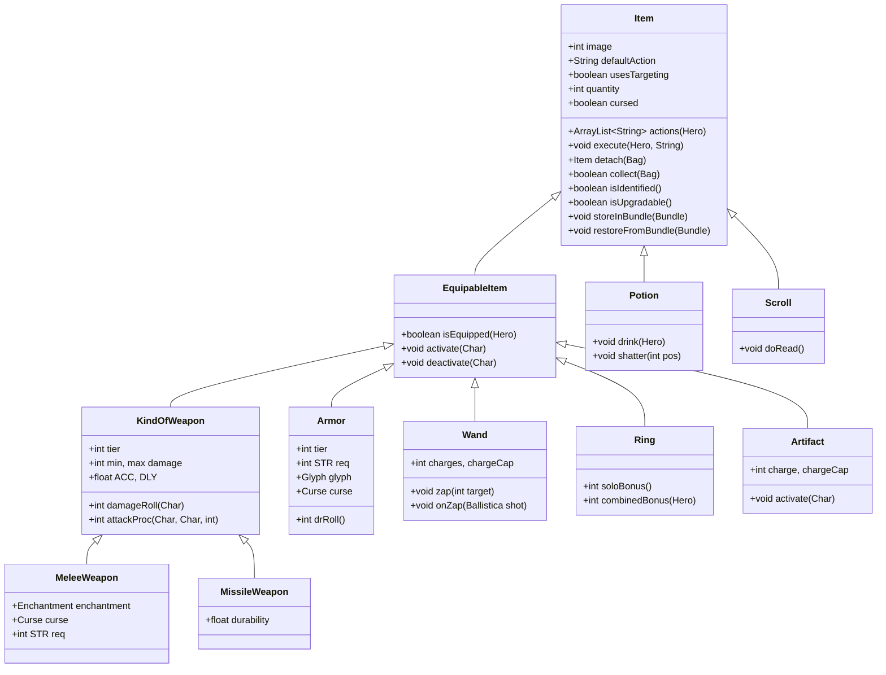
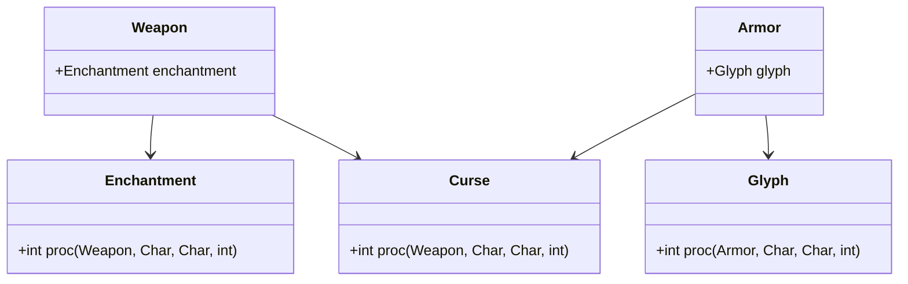

# Item System — Shattered Pixel Dungeon

## Item Class Hierarchy



## Item Categories

### Weapons

| Category | Package | Examples |
|---------|---------|---------|
| Melee (tier 1–5) | `items/weapon/melee/` | Dagger, Shortsword, Broadsword, BattleAxe, Glaive |
| Missiles | `items/weapon/missiles/` | Shuriken, Javelin, ForceCube, Tomahawk |
| Enchantments | `items/weapon/enchantments/` | Blazing, Chilling, Corrupting, Grim, Lucky, … |
| Weapon curses | `items/weapon/curses/` | Annoying, Displacing, Exhausting, Wayward, … |

Weapon tiers 1–5 scale with dungeon depth. Each melee weapon can have one enchantment (positive) or one curse (negative). Enchantments are added by `ScrollOfUpgrade` or `ScrollOfTransmutation`; curses appear on random drops.

### Armor

| Category | Package | Examples |
|---------|---------|---------|
| Armor (tier 1–5) | `items/armor/` | ClothArmor, LeatherArmor, MailArmor, ScaleArmor, PlateArmor |
| Glyphs | `items/armor/glyphs/` | Affection, Antimagic, Camouflage, Entanglement, … |
| Armor curses | `items/armor/curses/` | AntiEntropy, Corrosion, Displacement, Overgrowth, … |

### Potions

| Sub-category | Package |
|------------|---------|
| Standard | `items/potions/` |
| Exotic (transmuted) | `items/potions/exotic/` |
| Elixirs (alchemy) | `items/potions/elixirs/` |
| Brews (alchemy) | `items/potions/brews/` |

`Potion.drink(Hero)` is the main use path. `shatter(pos)` handles thrown potions hitting tiles or mobs.

### Scrolls

| Sub-category | Package |
|------------|---------|
| Standard | `items/scrolls/` |
| Exotic (transmuted) | `items/scrolls/exotic/` |

`Scroll.doRead()` is called by `execute()`. Scrolls are identified on first read (unless already IDed).

### Wands

Wands have a charge system (`charges`, `chargeCap`). `zap(target)` targets a tile; `onZap(Ballistica)` does the actual effect. Wands recharge over time via the `Recharging` buff.

### Rings

Rings provide passive bonuses. `Ring.soloBonus()` returns the bonus for one ring; `Ring.combinedBonus(Hero)` stacks duplicate rings. Rings are equipped in the two ring slots.

### Artifacts

Unique slot items with active and passive abilities. Each artifact has its own charge/cooldown mechanism. Most artifacts also level up via use.

### Trinkets

Small passive bonuses from the trinket slot. Unlike artifacts they have no charges.

## How to Add a New Item

### 1. Choose the right parent class

| New Item Type | Extend |
|--------------|--------|
| Generic use-item | `Item` |
| Throwable potion | `Potion` |
| Readable scroll | `Scroll` |
| Equippable weapon | `MeleeWeapon` or `MissileWeapon` |
| Equippable armor | `Armor` |
| Wand | `Wand` |
| Ring | `Ring` |
| Artifact | `Artifact` |
| Bag/container | `Bag` |

### 2. Implement required methods

```java
public class PotionOfAwesome extends Potion {

    {
        image = ItemSpriteSheet.POTION_CRIMSON; // pick a sprite constant
    }

    @Override
    protected void apply(Hero hero) {
        // effect when drunk by hero
        setKnown();
    }

    @Override
    public void shatter(int cell) {
        // effect when thrown / broken
    }
}
```

### 3. Add localization

In `core/src/main/assets/messages/items/potions.properties` (create new file if needed):

```properties
com.shatteredpixel.shatteredpixeldungeon.items.potions.PotionOfAwesome.name=Potion of Awesome
com.shatteredpixel.shatteredpixeldungeon.items.potions.PotionOfAwesome.desc=A very awesome potion. Drinking it fills you with awesome.
```

### 4. Add to loot tables (if it should drop)

Find the appropriate generator or loot list in `levels/` or `items/` and add a weighted entry.

### 5. Bundle serialization

If your item has non-trivial fields (beyond what the parent tracks), override:

```java
private static final String MY_VAL = "my_val";

@Override
public void storeInBundle(Bundle bundle) {
    super.storeInBundle(bundle);
    bundle.put(MY_VAL, myVal);
}

@Override
public void restoreFromBundle(Bundle bundle) {
    super.restoreFromBundle(bundle);
    myVal = bundle.getInt(MY_VAL);
}
```

Never reuse a bundle key that a parent class already uses — it will silently corrupt saves.

## Enchantment / Glyph / Curse System

Enchantments (weapons) and glyphs (armor) are **positive** modifiers. Curses are **negative**.



- `proc(weapon, attacker, defender, damage)` — called on each hit
- Return the (possibly modified) damage value
- Can attach buffs, spawn effects, etc.

To add a new enchantment: extend `Weapon.Enchantment`, implement `proc()`, add localization in `items/weapon/enchantments`.
