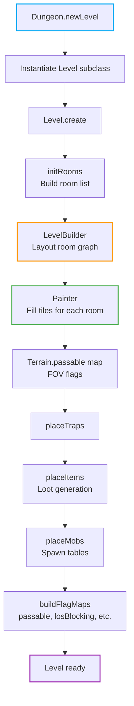
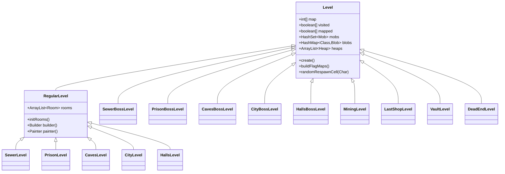
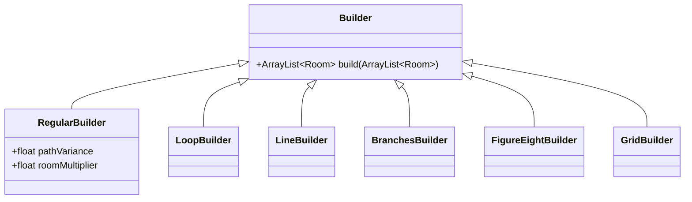

# Level Generation — Shattered Pixel Dungeon

## Pipeline Overview



## Level Types



### Level Assignment by Depth

| Depth | Level Class | Theme |
|-------|------------|-------|
| 1–4 | `SewerLevel` | Sewers |
| 5 | `SewerBossLevel` | Goo boss |
| 6–9 | `PrisonLevel` | Prison |
| 10 | `PrisonBossLevel` | Tengu boss |
| 11–14 | `CavesLevel` | Caves |
| 15 | `CavesBossLevel` | DM-300 boss |
| 16–19 | `CityLevel` | Dwarven City |
| 20 | `CityBossLevel` | King of Dwarves boss |
| 21–24 | `HallsLevel` | Demon Halls |
| 25 | `HallsBossLevel` | Yog-Dzewa final boss |
| Various | `MiningLevel` | Gnoll Caves quest |
| Various | `LastShopLevel` | Demon Halls shop |
| Various | `VaultLevel` | Thieves' den |
| Various | `DeadEndLevel` | Skeleton remains |

## Builders

Builders determine the **graph layout** of rooms (which rooms connect to which).



Each `RegularLevel` subclass overrides `builder()` to return the appropriate builder. For example, `SewerLevel` uses `RegularBuilder` with moderate variance; `CityLevel` uses a more grid-like layout.

## Rooms

Each `Room` has a rectangular bounds and a `Painter` assigned. Rooms are connected via `Room.Door` objects placed on shared edges.

### Room Categories

| Category | Package | Purpose |
|---------|---------|---------|
| Standard | `levels/rooms/standard/` | Regular traversal rooms |
| Special | `levels/rooms/special/` | Guaranteed-unique content rooms |
| Secret | `levels/rooms/secret/` | Hidden rooms behind secret doors |
| Quest | `levels/rooms/quest/` | Quest-specific rooms |
| Connection | `levels/rooms/connection/` | Corridor and transition rooms |
| Sewer Boss | `levels/rooms/sewerboss/` | Goo boss arena layout |

## Painters

A `Painter` fills the tile data for a single room. Standard rooms use `StandardPainter`; special rooms have their own dedicated painter logic embedded.

Key tile constants (from `Terrain.java`):

| Constant | Meaning |
|---------|---------|
| `WALL` | Impassable wall |
| `FLOOR` | Normal floor |
| `EMPTY` | Open space (passable) |
| `DOOR` | Closed door |
| `OPEN_DOOR` | Open door |
| `ENTRANCE` | Stairs up |
| `EXIT` | Stairs down |
| `LOCKED_DOOR` | Requires key |
| `CHASM` | Void (fall damage) |
| `WATER` | Water tile |
| `GRASS` | Tall grass |
| `TRAP` | Hidden trap |

## Tile Map

`Level.map` is a flat `int[]` of size `width × height`. Tile at `(x, y)` is at index `y * width + x`.

```java
// Read tile at position pos
int tile = level.map[pos];

// Check passability
boolean canPass = Level.passable[tile];
```

Flag maps computed by `buildFlagMaps()`:
- `Level.passable[]` — can characters walk here
- `Level.losBlocking[]` — blocks line of sight
- `Level.flamable[]` — can catch fire
- `Level.avoidable[]` — actors avoid if possible (e.g. chasms)

## Traps

Placed during `placeTraps()` after room painting. Each trap extends `Trap` and implements `activate()`. The number of traps scales with depth.

## Seeding

`Dungeon.seedCurDepth()` produces a per-depth random seed derived from the run seed + depth. This allows the same run seed to always produce the same level at a given depth, enabling reproducibility.
